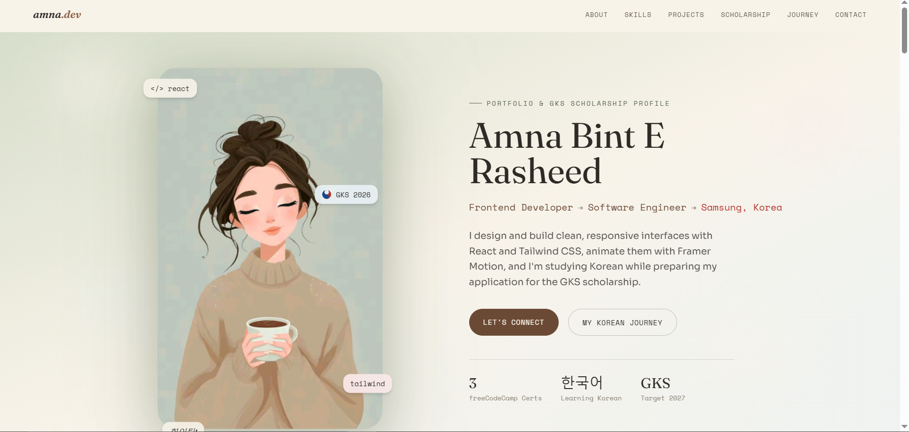
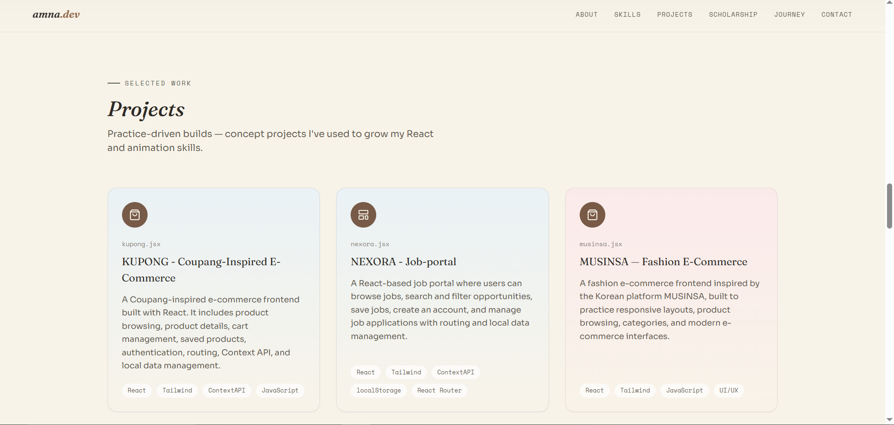
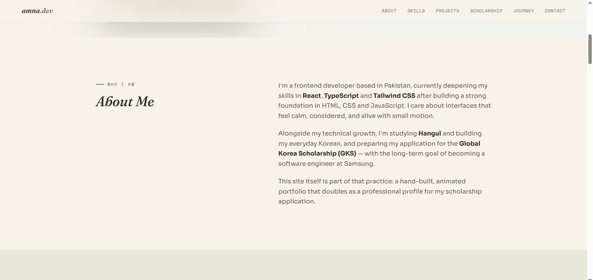
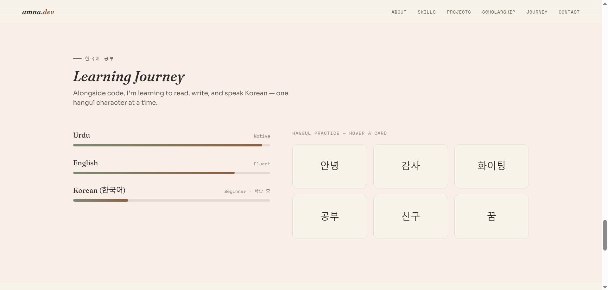

# Amna — GKS Scholarship Portfolio

A modern, Korean-inspired animated portfolio built with **React**, **Tailwind CSS**,
and **Framer Motion**.

----------------------------------------------------

## Features

- **Hero** — animated pastel/cloud background with your illustration integrated directly into the layout
- **About Me** — frontend dev background, GKS goal, Hangul study
- **Skills** — React, Tailwind, TypeScript, JavaScript, Framer Motion, API integration
- **Projects** — Musinsa-inspired shop clone, kupong, NEXORA Job-portal and MotoShop.
- **Scholarship Prep** — roadmap timeline (scroll-driven progress line) + SOP highlights
- **Learning Journey** — Korean/Hangul progress bars + flip-to-reveal Hangul flashcards
- **Contact** — social links + a working contact form (opens the visitor's email client, ready to be wired to Formspree/EmailJS)

-------------------------------------------------------------

## SCREENSHOTS 

###  Home Page


###  Projects Page


###  About Page


###  Journey Page


-----------------------------------------------------------

## LIVE DEMO

- [Click here for gks-portfolio]()

-----------------------------------

## Clone the Repository
```bash
git clone 


